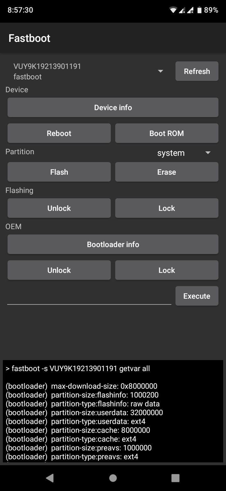
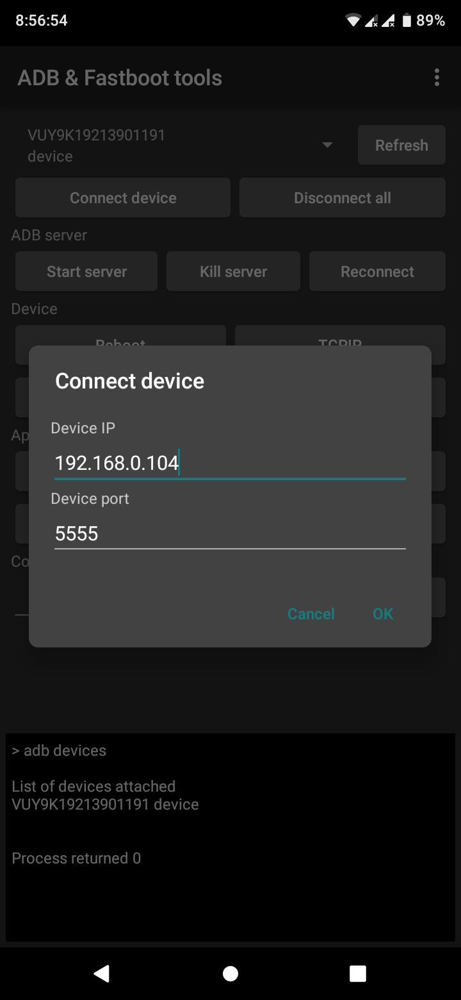
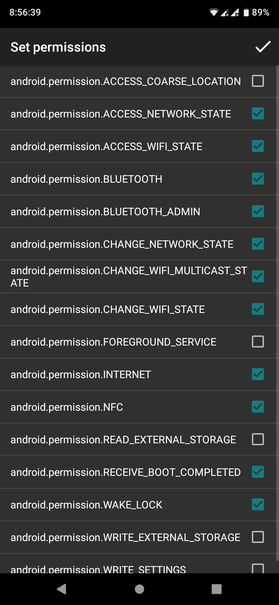
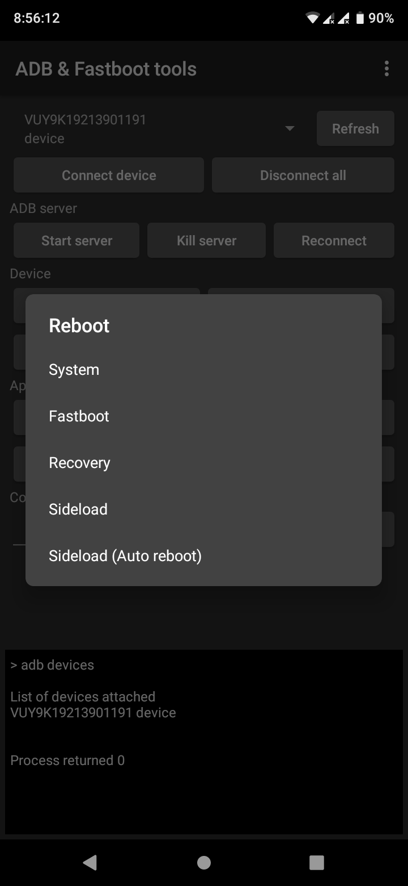
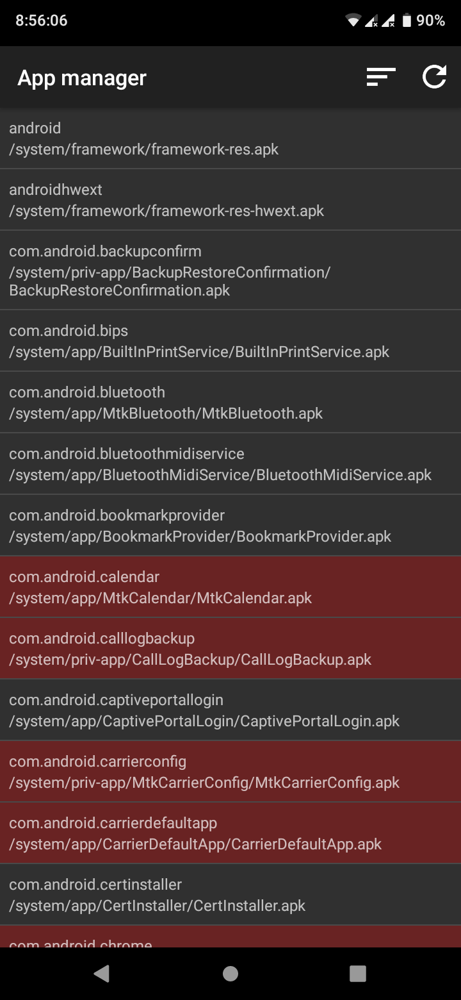
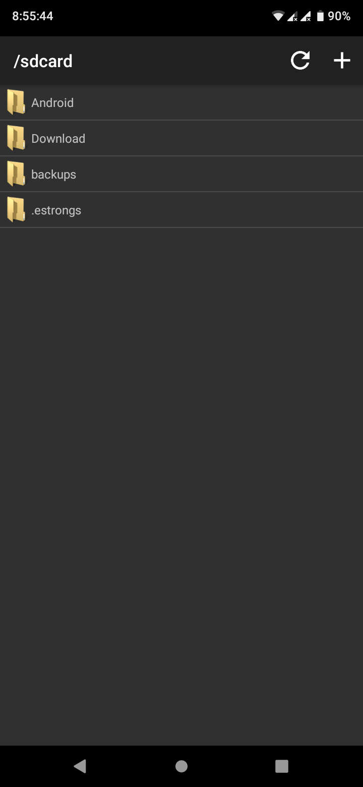
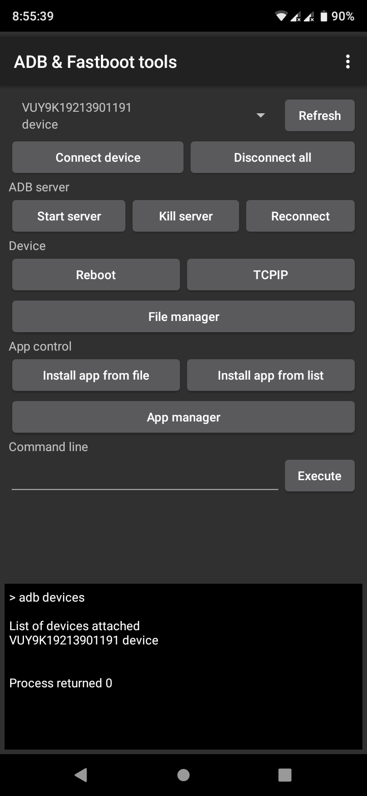

# ADB &amp; Fastboot tools for Android

Full support of OTG connection and wireless debugging. Need root permission to work!

## Main features

* File manager
* App manager
* Fast app installing
* Multiple device support
* Command line

## Screenshots

<p float="left">







</p>

## Build
```
export ANDROID_HOME=/path/to/android/SDK/
./gradlew installDebug
```
